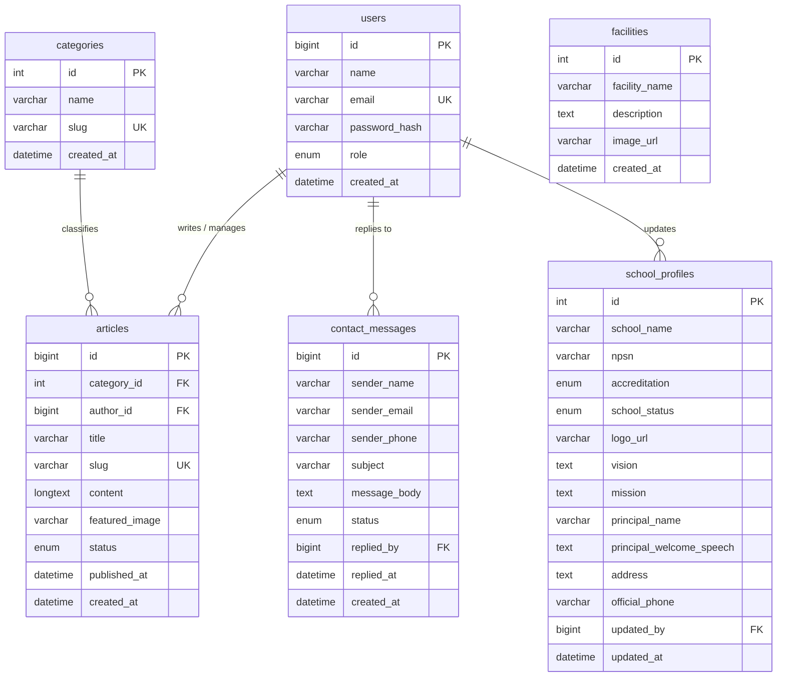

# Dokumentasi Perencanaan Menu, Arsitektur Informasi, ERD & UI Wireframe (Milestone 1)

**Proyek:** Sistem Website Profil Sekolah & Back-Office CMS  
**Topik:** 09 – Sistem Informasi & Manajemen Konten Sekolah  
**Tahap:** Milestone 1 (Pekan Ke-3) — Perencanaan Menu, Arsitektur Informasi, Basis Data (ERD), dan Panduan UI  
**Desain Sistem Acuan:** Google Material Design 3 (Clean, Functional, Card-based, Responsive)

---

## 1. Pendahuluan & Ringkasan Sistem

Sistem Manajemen Konten (CMS) Website Profil Sekolah adalah platform terpadu yang memadukan dua antarmuka:

### Frontend Publik

Media representasi sekolah bagi calon siswa, wali murid, dan publik untuk meninjau profil resmi, prestasi, agenda/berita, serta mengajukan pertanyaan langsung via formulir kontak.

### Back-Office CMS (Admin Panel)

Panel kendali internal berbasis otentikasi ketat bagi staf Humas, Tata Usaha, dan Administrator IT untuk memperbarui profil sekolah, mengelola artikel berita (Full CRUD), dan menindaklanjuti pesan masuk.

---

## 2. Struktur Menu & Sitemap Lengkap

```text
[PORTAL WEBSITE & CMS PROFIL SEKOLAH]
│
├── A. FRONTEND PUBLIK (Visitor Portal)
│   ├── 1. Beranda Utama (Hero Slider, Sambutan Kepsek, Berita Unggulan, Profil Singkat)
│   ├── 2. Profil Sekolah
│   │   ├── Identitas & Sejarah Sekolah
│   │   ├── Visi, Misi & Sasaran Mutu
│   │   ├── Sambutan Lengkap & Struktur Organisasi
│   │   └── Sarana, Prasarana & Fasilitas Unggulan
│   ├── 3. Berita & Kegiatan Sekolah
│   │   ├── Direktori Berita (Pencarian & Filter Kategori)
│   │   └── Halaman Detail Berita (Baca Lengkap, Galeri, Share Medsos)
│   └── 4. Kontak & Layanan Informasi
│       ├── Alamat, Jam Operasional & Titik Peta (Google Maps)
│       └── Formulir Kontak Publik (Pertanyaan / Registrasi Info PPDB)
│
└── B. BACK-OFFICE CMS (Admin Management Portal)
    ├── 1. Autentikasi (Halaman Login Admin)
    ├── 2. Dashboard Ringkasan
    │   ├── 4 Kartu Metrik Utama (Berita Terbit, Draf, Pesan Baru, Pengunjung)
    │   ├── Tabel Pintas 5 Pesan Terkini
    │   └── Linimasa Log Aktivitas Administrator
    ├── 3. Manajemen Profil Sekolah
    │   ├── Tab Identitas Utama (NPSN, Status, Akreditasi, Unggah Logo)
    │   ├── Tab Visi, Misi & Sejarah
    │   ├── Tab Foto & Sambutan Kepala Sekolah
    │   ├── Tab Fasilitas & Sarana Prasarana
    │   └── Tab Kontak Resmi, Medsos & Titik Sematan Peta
    ├── 4. Manajemen Berita & Artikel
    │   ├── [READ] Daftar Berita (Tabel Data, Pencarian, Filter Kategori, Status)
    │   ├── [CREATE] Form Tambah Berita Baru (WYSIWYG Editor, Cover, Kategori)
    │   ├── [UPDATE] Form Edit Berita (Pemutakhiran Konten & Metadata)
    │   └── [DELETE] Modal Dialog Konfirmasi Hapus Berita
    ├── 5. Manajemen Kontak Masuk (Inbox)
    │   ├── [READ] Daftar Pesan Masuk (Filter Status Belum Dibaca / Selesai)
    │   ├── [DETAIL/REPLY] Detail Pesan & Formulir Balas via Email/WhatsApp Web
    │   └── [DELETE] Aksi Hapus / Arsip Pesan
    └── 6. Pengaturan Akun & Keamanan
        ├── Profil Admin (Nama, Username, Surel)
        └── Form Ganti Kata Sandi (Validasi Password Lama, Baru, dan Konfirmasi)
```

---

## 3. Rincian Kebutuhan Fungsional per Menu

### 3.1. Frontend Publik (Sisi Pengunjung)

#### Beranda Utama

Menampilkan navigasi sticky, hero banner slider, rangkuman visi-misi, sambutan kepala sekolah dengan foto formal, cuplikan 3 berita terbaru dengan label kategori, dan footer legalitas.

#### Halaman Baca Detail Berita

Memuat breadcrumbs, judul artikel, tanggal terbit, nama staf humas/penulis, gambar utama, konten teks terformat, tombol share ke WhatsApp/media sosial, serta rekomendasi artikel terkait.

#### Formulir Kontak Publik

Form interaktif yang memvalidasi nama lengkap, surel, nomor telepon/WhatsApp, subjek, serta isi pertanyaan. Pengiriman data secara otomatis dialirkan ke basis data CMS Admin.

### 3.2. Back-Office CMS (Sisi Administrator)

#### Login Admin

Otentikasi aman menggunakan username/email dan kata sandi dengan visibilitas toggle, checkbox Remember Me, dan penanganan sesi terenkripsi.

#### Dashboard Ringkasan

Memberikan status sistem instan berupa 4 kartu statistik, tabel respon cepat untuk pesan belum terbaca, dan linimasa aktivitas pengunggahan data.

#### Manajemen Profil Sekolah

Formulir tabulasi terstruktur untuk mengubah profil dasar, legalitas, sejarah, unggah foto kepala sekolah, dan sematan peta interaktif tanpa mengedit kode sumber.

#### Manajemen Berita (CRUD Lengkap)

**Read:**  
Tabel data berita yang dilengkapi pencarian real-time, filter per kategori, filter chip status (Published/Draft), dan penomoran halaman (pagination).

**Create & Update:**  
Editor WYSIWYG lengkap dengan format teks, penyematan tautan/gambar, pemilihan kategori, pemilihan status publikasi, serta area unggah gambar cover.

**Delete:**  
Proteksi penghapusan berbasis dialog pop-up modal untuk menghindari accidental delete.

#### Manajemen Kontak Masuk (Inbox & Reply)

Panel terbagi (split-view) untuk menyeleksi pesan masuk, menampilkan rincian kontak pengirim, serta formulir balasan langsung yang terintegrasi dengan tautan surel atau API WhatsApp Web.

#### Pengaturan Akun

Halaman ganti kata sandi dengan validasi keamanan sandi (strength indicator) serta ringkasan informasi peran akun admin.

---

# 4. Perancangan Basis Data Awal (Entity Relationship Diagram - ERD)

## 4.1. Kamus Data Entitas & Atribut

### `users` — Akun Administrator CMS

| Atribut | Tipe | Keterangan |
|---|---|---|
| `id` | BigInt | PK, Auto Increment |
| `name` | Varchar 100 | Nama lengkap pengelola |
| `email` | Varchar 100 | Unique, email login |
| `password_hash` | Varchar 255 | Enkripsi kata sandi |
| `role` | Enum | `superadmin`, `humas`, `editor` |
| `created_at` | Datetime | Waktu pembuatan |
| `updated_at` | Datetime | Waktu pembaruan |

### `school_profiles` — Data Identitas & Profil Sekolah (Single Row)

| Atribut | Tipe | Keterangan |
|---|---|---|
| `id` | Int | PK, Auto Increment |
| `school_name` | Varchar 150 | Nama resmi sekolah |
| `npsn` | Varchar 20 | Nomor Pokok Sekolah Nasional |
| `accreditation` | Enum | `A`, `B`, `C`, `Belum Terakreditasi` |
| `school_status` | Enum | `Negeri`, `Swasta` |
| `logo_url` | Varchar 255 | URL/path logo sekolah |
| `banner_url` | Varchar 255 | URL/path banner sekolah |
| `short_history` | Text | Sejarah singkat sekolah |
| `vision` | Text | Teks visi |
| `mission` | Text | Teks misi |
| `principal_name` | Varchar 120 | Nama & gelar kepala sekolah |
| `principal_photo_url` | Varchar 255 | URL/path foto kepala sekolah |
| `principal_welcome_speech` | Text | Teks sambutan |
| `address` | Text | Alamat fisik |
| `maps_embed_url` | Text | Tautan sematan peta |
| `official_phone` | Varchar 30 | Nomor telepon resmi |
| `official_email` | Varchar 100 | Email resmi |
| `official_whatsapp` | Varchar 30 | WhatsApp resmi |
| `updated_by` | FK → `users.id` | Admin yang melakukan pembaruan |
| `updated_at` | Datetime | Waktu pembaruan |

### `facilities` — Fasilitas & Sarana Prasarana Sekolah

| Atribut | Tipe | Keterangan |
|---|---|---|
| `id` | Int | PK, Auto Increment |
| `facility_name` | Varchar 100 | Misal: Laboratorium Komputer, Lapangan Basket |
| `description` | Text | Deskripsi fasilitas |
| `image_url` | Varchar 255 | URL/path gambar |
| `created_at` | Datetime | Waktu pembuatan |

### `categories` — Kategori Berita & Artikel

| Atribut | Tipe | Keterangan |
|---|---|---|
| `id` | Int | PK, Auto Increment |
| `name` | Varchar 60 | Misal: Akademik, Prestasi, Ekstrakurikuler, Pengumuman |
| `slug` | Varchar 80 | Unique |
| `created_at` | Datetime | Waktu pembuatan |

### `articles` — Konten Berita & Publikasi Kegiatan

| Atribut | Tipe | Keterangan |
|---|---|---|
| `id` | BigInt | PK, Auto Increment |
| `category_id` | FK → `categories.id` | Kategori artikel |
| `author_id` | FK → `users.id` | Penulis artikel |
| `title` | Varchar 255 | Judul artikel |
| `slug` | Varchar 255 | Unique, URL slug artikel |
| `content` | LongText | Konten HTML editor |
| `featured_image` | Varchar 255 | Path banner/cover |
| `status` | Enum | `published`, `draft`, `archived` |
| `published_at` | Datetime | Nullable, waktu publikasi |
| `created_at` | Datetime | Waktu pembuatan |
| `updated_at` | Datetime | Waktu pembaruan |

### `contact_messages` — Pesan Masuk dari Formulir Publik

| Atribut | Tipe | Keterangan |
|---|---|---|
| `id` | BigInt | PK, Auto Increment |
| `sender_name` | Varchar 100 | Nama pengirim |
| `sender_email` | Varchar 100 | Email pengirim |
| `sender_phone` | Varchar 30 | Nomor WhatsApp |
| `subject` | Varchar 150 | Subjek pesan |
| `message_body` | Text | Isi pertanyaan |
| `status` | Enum | `unread`, `read`, `replied` |
| `reply_notes` | Text | Nullable, catatan balasan |
| `replied_by` | FK → `users.id` | Nullable, admin yang membalas |
| `replied_at` | Datetime | Nullable, waktu balasan |
| `created_at` | Datetime | Waktu pesan masuk |

---

## 4.2. Diagram Hubungan Relasi (Mermaid ERD)



> **Catatan:** Entitas `facilities` sudah didefinisikan dalam kamus data, tetapi pada diagram relasi di atas belum memiliki foreign key karena fasilitas berdiri sebagai data mandiri yang terkait dengan profil sekolah secara konseptual.

---

# 5. Panduan Master Prompt UI Wireframe (Google Stitch)

> Salin seluruh teks di bawah ini dan gunakan langsung pada Google Stitch.

```text
Create a complete multi-screen web UI prototype for a "School Profile Website & Back-Office CMS" following Google Material Design 3 guidelines.

=== GLOBAL DESIGN SYSTEM & TOKENS ===
- Primary Color: Deep Educational Navy Blue (#1565C0)
- Primary Container / Active Background: Soft Ice Blue (#E3F2FD)
- Surface Background: Neutral Clean Gray (#F8F9FA)
- Cards & Elevators: Pure White (#FFFFFF), subtle outline border (#E0E0E0), 12px corner radius.
- Buttons & Textfield Radius: 8px.
- Typography: Roboto / Google Sans.
- Accents & Status: Success Green (#2E7D32) for Published, Amber (#F57C00) for Drafts, Alert Red (#D32F2F) for Delete/Unread badges.


---

PART 1: FRONTEND WEBSITE PUBLIK (VISITOR INTERFACE)

SCREEN 1: Public Homepage (Beranda Utama Sekolah)
- Header: Sticky navbar with school logo, school name "SMA Negeri 1", links [Beranda, Profil, Berita, Fasilitas, Hubungi Kami], and a CTA button "Portal PPDB / Kontak".
- Hero Section: High-impact hero carousel banner with title "Mewujudkan Generasi Cerdas & Berkarakter", subtitle, and filled button "Jelajahi Profil".
- Sambutan Singkat: Profile photo of School Principal, official credentials, and welcome quote.
- Latest News: 3-column card grid of recent articles with category chips, cover thumbnails, release dates, and "Baca Selengkapnya" links.
- Facilities Highlight: 3-column photo grid highlighting modern campus facilities (e.g. Science Lab, Smart Library).
- Footer: Campus address, Google Maps snippet, social media links, accreditation badge "Akreditasi A (Unggul)", and copyright.

SCREEN 2: Public Detail Berita (Article Reading View)
- Layout: Public navbar & clean single-column reader layout (max-width 800px).
- Content:
  - Breadcrumbs: Home > Berita > Prestasi.
  - Article title, category badge, published date, author "Humas SMA Negeri 1".
  - Hero featured banner image.
  - Formatted editorial body text with subheadings, quotes, and inline images.
  - Social share buttons (WhatsApp, Facebook, Twitter, Copy Link).
  - Bottom section: "Berita Terkait" 2-column cards.


---

PART 2: ADMIN CMS (AUTHENTICATION & DASHBOARD)

SCREEN 3: Admin Login Screen
- Layout: Centered standalone Material card (width: 420px) on #F8F9FA background.
- Content: School emblem, title "CMS Admin Portal", outlined text fields for Username/Email and Password (with visibility eye toggle), "Ingat Saya" checkbox, "Lupa Password?" link, and full-width primary button "Masuk ke Dashboard".

SCREEN 4: Admin Dashboard Ringkasan
- Layout: Standard Admin Layout (Fixed 260px Left Sidebar, Top Bar with admin profile & notifications, Main 12-col grid). Sidebar menu "Dashboard" active.
- Content:
  - Header greeting: "Selamat Datang, Administrator Humas".
  - 4 Metric cards: "Berita Diterbitkan (24)", "Draft Artikel (3)", "Pesan Baru (5)", "Pengunjung Bulan Ini (1.420)".
  - Left column (8 cols): Recent inbox messages quick-table with unread status badges.
  - Right column (4 cols): Recent activity log feed (e.g. "Admin updated School History 2 hours ago").


---

PART 3: ADMIN CMS (MANAJEMEN PROFIL SEKOLAH)

SCREEN 5: Manajemen Profil Sekolah (View & Edit Tabs)
- Layout: Standard Admin Layout, sidebar "Profil Sekolah" active.
- Header: Title "Manajemen Profil Sekolah" and top-right "Simpan Perubahan" primary button.
- Tab Navigation: [Identitas Umum (Active), Visi & Misi, Sambutan Kepsek, Kontak & Lokasi].
- Form Container:
  - 2-column form grid: Outlined text fields for School Name, NPSN, Accreditation dropdown, School Status (Negeri).
  - Drag-and-drop image upload zones for School Emblem and Hero Banner.
  - Rich text editor for "Sejarah & Profil Singkat".
  - Sticky bottom action bar with "Batal" (outlined button) and "Simpan Perubahan" (filled primary button).


---

PART 4: ADMIN CMS (FULL CRUD BERITA & ARTIKEL)

SCREEN 6: Daftar Berita & Artikel (List / Read View)
- Layout: Standard Admin Layout, sidebar "Berita & Artikel" active.
- Header: Title "Daftar Berita & Artikel" with primary button "+ Buat Berita Baru".
- Filter Bar: Search input with search icon, category dropdown (Prestasi, Akademik, Event), and status chips [Semua, Published, Draft].
- Data Table:
  - Columns: Thumbnail, Judul Berita, Kategori (chip), Tanggal Terbit, Status (Pill badges: Green Published, Orange Draft), Aksi (Edit pencil icon, Delete trash icon, Preview eye icon).
- Bottom Pagination: Page count, rows per page, and next/previous arrows.

SCREEN 7: Form Buat & Edit Berita (Create & Update View)
- Layout: Standard Admin Layout with back-arrow header "Editor Berita: Tambah / Edit Artikel".
- 2-Column Split:
  - Left Panel (70%): Outlined field "Judul Berita", Category dropdown, full WYSIWYG Editor box (Formatting bar: Bold, Italic, Link, Image, Lists) and large content text area.
  - Right Panel (30%):
    - Card 1: Featured Image / Cover banner upload container with drag-and-drop placeholder and preview.
    - Card 2: Status & Publish settings (Radio buttons: "Simpan Draft" vs "Terbitkan Langsung", publish date picker, tags input).
    - Bottom Actions: "Simpan Draft" (outlined button) and "Publikasikan Sekarang" (primary filled button).


---

PART 5: ADMIN CMS (INBOX & DETAIL PESAN)

SCREEN 8: Manajemen Kontak Masuk & Detail Balasan (Inbox & Reply View)
- Layout: Standard Admin Layout, sidebar "Kontak Masuk" active (badge: 5).
- Two-Pane Split Layout:
  - Left Pane (40%): Inbox search bar, status tabs [Semua, Belum Dibaca], and list of incoming messages with sender name, subject line snippet, timestamp, and unread dot indicator.
  - Right Pane (60% - Detail & Reply Card):
    - Header: Sender full name, email address, WhatsApp number, submission date.
    - Message Body: Full inquiry text (e.g. Question about PPDB Admission).
    - Reply Box: Inline text area "Tulis Balasan untuk Pengirim...", dropdown for sending via "Email Resmi" or "Buka WhatsApp Web", and primary action button "Kirim Balasan".
    - Secondary Action: Red outlined button "Hapus Pesan".


---

PART 6: ADMIN CMS (AKUN & KEAMANAN)

SCREEN 9: Pengaturan Akun & Ganti Password
- Layout: Standard Admin Layout, sidebar "Pengaturan Akun" active.
- Centered Card (Width: 600px):
  - Profile header: Admin avatar, display name, email, and "Super Admin" role badge.
  - Form Fields: Current Password, New Password (with visual password strength meter), and Confirm New Password.
  - Helper security guidelines note.
  - Action buttons: "Batal" (text button) and "Perbarui Kata Sandi" (primary button).
```

---

## 6. Ringkasan Milestone 1

Milestone 1 menghasilkan rancangan awal sistem yang mencakup:

1. **Struktur Menu & Sitemap** untuk memetakan navigasi Frontend Publik dan Back-Office CMS.
2. **Kebutuhan Fungsional** untuk setiap menu dan fitur utama.
3. **Kamus Data & ERD** sebagai dasar perancangan basis data.
4. **Master Prompt UI Wireframe** untuk menghasilkan prototype multi-screen menggunakan Google Stitch.
5. **Panduan Visual** berbasis Google Material Design 3 dengan pendekatan clean, functional, card-based, dan responsive.

Dokumentasi ini menjadi acuan awal untuk masuk ke tahap desain UI yang lebih detail, implementasi basis data, serta pengembangan Frontend dan Back-Office CMS pada milestone berikutnya.
