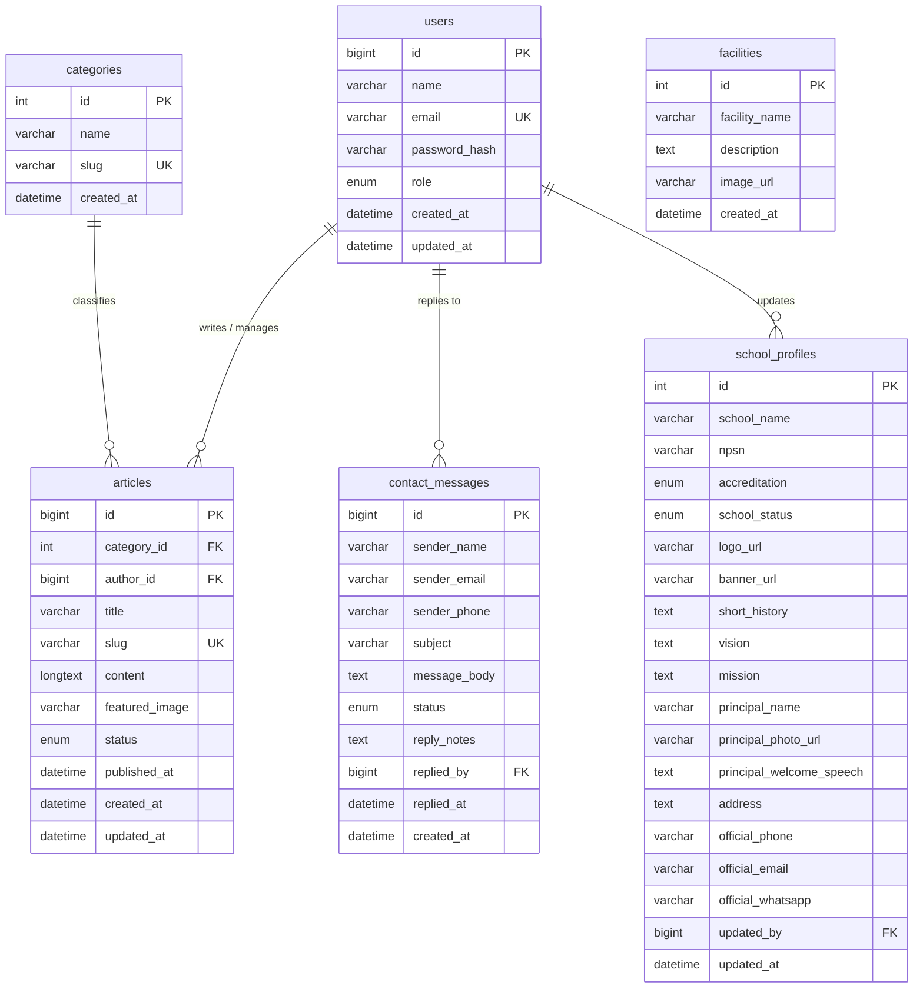

# PERANCANGAN.md — CMS Website Profil SMAK Stella Maris

**Proyek:** CMS Website Profil SMAK Stella Maris  
**Topik:** 09 – CMS Company Profile / Website Profil Sekolah  
**Nama Sekolah:** SMAK Stella Maris  
**Jenis Sekolah:** Sekolah Menengah Atas Katolik  
**Tahap:** Milestone 1 — Perencanaan Menu, Arsitektur Informasi, ERD, Design System, dan UI Wireframe  
**Desain Sistem:** Glassmorphism  
**Gaya Visual:** Modern, Soft, Clean, Elegant, Friendly, Responsive  

---

## 1. Pendahuluan & Ringkasan Sistem

Sistem Manajemen Konten (CMS) Website Profil SMAK Stella Maris merupakan rancangan sistem untuk mengelola dan menampilkan informasi resmi sekolah melalui dua bagian utama, yaitu **Public Page** dan **Admin Private Page**.

Sistem berfokus pada pengelolaan informasi dan konten website dari sisi client-side. Implementasi tidak memerlukan database server sehingga data dapat menggunakan mock data.

### 1.1 Public Page

Public Page merupakan bagian website yang dapat diakses oleh pengunjung sebagai media informasi resmi SMAK Stella Maris.

Informasi yang dapat ditampilkan meliputi:

- Profil sekolah
- Sejarah sekolah
- Visi dan misi
- Sambutan kepala sekolah
- Berita dan kegiatan sekolah
- Prestasi
- Fasilitas
- Galeri
- Informasi kontak

### 1.2 Admin Private Page

Admin Private Page merupakan bagian privat yang digunakan administrator untuk mengelola konten website.

Fitur utama:

- Login administrator
- Dashboard
- Manajemen profil sekolah
- Manajemen berita dan artikel
- News Editor
- Contact Inbox
- Account Settings

Struktur Admin Panel terdiri dari Sidebar, Header, Content Area, dan Footer.

---

## 2. Struktur Menu & Sitemap

```text
[ SMAK STELLA MARIS — WEBSITE & CMS ]

├── A. PUBLIC PAGE
│   ├── 1. Beranda
│   ├── 2. Profil Sekolah
│   │   ├── Identitas Sekolah
│   │   ├── Sejarah Sekolah
│   │   ├── Visi & Misi
│   │   ├── Sambutan Kepala Sekolah
│   │   └── Fasilitas
│   ├── 3. Berita & Kegiatan
│   │   ├── Daftar Berita
│   │   └── Detail Berita
│   ├── 4. Prestasi
│   ├── 5. Galeri
│   └── 6. Kontak
│       ├── Informasi Kontak
│       └── Formulir Kontak
│
└── B. ADMIN PRIVATE PAGE
    ├── 1. Login Admin
    ├── 2. Dashboard
    ├── 3. Manajemen Profil Sekolah
    │   ├── Identitas Sekolah
    │   ├── Visi & Misi
    │   ├── Sejarah Sekolah
    │   ├── Sambutan Kepala Sekolah
    │   └── Fasilitas
    ├── 4. Manajemen Berita & Artikel
    │   ├── Daftar Berita
    │   ├── Tambah Berita
    │   ├── Edit Berita
    │   └── Hapus Berita
    ├── 5. News Editor
    ├── 6. Contact Inbox
    └── 7. Account Settings
```

### 2.1 Struktur Screen UI

```text
DESIGN SYSTEM

PUBLIC PAGE
├── 01. Public Homepage
└── 02. Public News Detail

ADMIN PRIVATE PAGE
├── 03. Admin Login
├── 04. Admin Dashboard
├── 05. School Profile Management
├── 06. News & Article Management
├── 07. News Editor
├── 08. Contact Inbox
└── 09. Account Settings
```

---

## 3. Rincian Kebutuhan Fungsional

### 3.1 Public Page

#### 3.1.1 Public Homepage

Komponen utama:

- Logo dan nama sekolah
- Navigasi utama
- Hero section
- Sambutan kepala sekolah
- Profil singkat sekolah
- Berita terbaru
- Prestasi
- Fasilitas
- Galeri
- Informasi kontak
- Footer

#### 3.1.2 Public News Detail

Komponen:

- Breadcrumb
- Judul berita
- Kategori berita
- Tanggal publikasi
- Penulis
- Gambar utama
- Isi berita
- Tombol berbagi
- Berita terkait

#### 3.1.3 Formulir Kontak Publik

Field:

- Nama lengkap
- Email
- Nomor telepon/WhatsApp
- Subjek
- Isi pesan

Pada tahap client-side, data formulir dapat menggunakan mock data.

### 3.2 Admin Private Page

#### 3.2.1 Admin Login

- Logo SMAK Stella Maris
- Username/Email
- Password
- Tombol tampil/sembunyikan password
- Checkbox "Ingat Saya"
- Tombol "Masuk"

#### 3.2.2 Admin Dashboard

- Total berita
- Total pengumuman
- Data guru
- Prestasi
- Aktivitas terbaru

#### 3.2.3 Manajemen Profil Sekolah

- Nama sekolah
- NPSN
- Status sekolah
- Akreditasi
- Logo
- Banner
- Sejarah
- Visi
- Misi
- Nama kepala sekolah
- Sambutan kepala sekolah
- Alamat
- Nomor telepon
- Email
- WhatsApp
- Informasi fasilitas

#### 3.2.4 Manajemen Berita & Artikel

**Read**
- Daftar berita dalam tabel
- Pencarian
- Filter kategori
- Filter status

**Create**
- Judul
- Kategori
- Isi berita
- Gambar
- Status

**Update**
- Mengubah data berita

**Delete**
- Menghapus berita dengan konfirmasi modal

#### 3.2.5 News Editor

- Judul berita
- Kategori
- Editor isi berita
- Upload gambar
- Status berita
- Tanggal publikasi
- Simpan draft
- Publikasi

#### 3.2.6 Contact Inbox

- Search
- Daftar pesan
- Status pesan
- Detail pesan
- Informasi pengirim
- Isi pesan
- Formulir balasan
- Tombol hapus

#### 3.2.7 Account Settings

- Foto/avatar admin
- Nama
- Email
- Role
- Password lama
- Password baru
- Konfirmasi password
- Password strength indicator
- Simpan perubahan

---

## 4. Perancangan Basis Data Awal (ERD)

Walaupun project berfokus pada client-side dan tidak menggunakan database server, ERD digunakan sebagai rancangan struktur data yang menjadi dasar penggunaan mock data.

### 4.1 Kamus Data

#### `users` — Akun Administrator CMS

| Atribut | Tipe | Keterangan |
|---|---|---|
| `id` | BigInt | PK, Auto Increment |
| `name` | Varchar 100 | Nama lengkap pengelola |
| `email` | Varchar 100 | Unique, email login |
| `password_hash` | Varchar 255 | Enkripsi kata sandi |
| `role` | Enum | `superadmin`, `humas`, `editor` |
| `created_at` | Datetime | Waktu pembuatan |
| `updated_at` | Datetime | Waktu pembaruan |

#### `school_profiles` — Data Profil Sekolah

| Atribut | Tipe | Keterangan |
|---|---|---|
| `id` | Int | PK, Auto Increment |
| `school_name` | Varchar 150 | Nama resmi sekolah |
| `npsn` | Varchar 20 | Nomor Pokok Sekolah Nasional |
| `accreditation` | Enum | `A`, `B`, `C`, `Belum Terakreditasi` |
| `school_status` | Enum | `Negeri`, `Swasta` |
| `logo_url` | Varchar 255 | URL/path logo |
| `banner_url` | Varchar 255 | URL/path banner |
| `short_history` | Text | Sejarah singkat |
| `vision` | Text | Visi |
| `mission` | Text | Misi |
| `principal_name` | Varchar 120 | Nama kepala sekolah |
| `principal_photo_url` | Varchar 255 | URL/path foto kepala sekolah |
| `principal_welcome_speech` | Text | Sambutan |
| `address` | Text | Alamat |
| `maps_embed_url` | Text | Tautan peta |
| `official_phone` | Varchar 30 | Telepon resmi |
| `official_email` | Varchar 100 | Email resmi |
| `official_whatsapp` | Varchar 30 | WhatsApp resmi |
| `updated_by` | FK → `users.id` | Admin yang memperbarui |
| `updated_at` | Datetime | Waktu pembaruan |

#### `facilities` — Fasilitas Sekolah

| Atribut | Tipe | Keterangan |
|---|---|---|
| `id` | Int | PK, Auto Increment |
| `facility_name` | Varchar 100 | Nama fasilitas |
| `description` | Text | Deskripsi |
| `image_url` | Varchar 255 | URL/path gambar |
| `created_at` | Datetime | Waktu pembuatan |

#### `categories` — Kategori Berita

| Atribut | Tipe | Keterangan |
|---|---|---|
| `id` | Int | PK, Auto Increment |
| `name` | Varchar 60 | Nama kategori |
| `slug` | Varchar 80 | Unique |
| `created_at` | Datetime | Waktu pembuatan |

Contoh kategori:

- Akademik
- Prestasi
- Ekstrakurikuler
- Kegiatan Sekolah
- Pengumuman

#### `articles` — Berita & Artikel

| Atribut | Tipe | Keterangan |
|---|---|---|
| `id` | BigInt | PK, Auto Increment |
| `category_id` | FK → `categories.id` | Kategori |
| `author_id` | FK → `users.id` | Penulis |
| `title` | Varchar 255 | Judul |
| `slug` | Varchar 255 | Unique |
| `content` | LongText | Isi artikel |
| `featured_image` | Varchar 255 | Path gambar |
| `status` | Enum | `published`, `draft`, `archived` |
| `published_at` | Datetime | Waktu publikasi |
| `created_at` | Datetime | Waktu pembuatan |
| `updated_at` | Datetime | Waktu pembaruan |

#### `contact_messages` — Pesan Kontak

| Atribut | Tipe | Keterangan |
|---|---|---|
| `id` | BigInt | PK, Auto Increment |
| `sender_name` | Varchar 100 | Nama pengirim |
| `sender_email` | Varchar 100 | Email |
| `sender_phone` | Varchar 30 | Nomor WhatsApp |
| `subject` | Varchar 150 | Subjek |
| `message_body` | Text | Isi pesan |
| `status` | Enum | `unread`, `read`, `replied` |
| `reply_notes` | Text | Catatan balasan |
| `replied_by` | FK → `users.id` | Admin yang membalas |
| `replied_at` | Datetime | Waktu balasan |
| `created_at` | Datetime | Waktu pesan masuk |

### 4.2 Mermaid ERD



> **Catatan:** Entitas `facilities` merupakan data fasilitas sekolah yang berdiri sebagai data mandiri. Pada rancangan awal ini belum diberikan foreign key langsung ke `school_profiles`.

---

## 5. Design System & Perancangan UI

### 5.1 Konsep Visual

Perancangan antarmuka menggunakan pendekatan **Glassmorphism** dengan gaya modern, soft, clean, elegant, dan friendly.

Glassmorphism digunakan secara terbatas melalui transparansi ringan, blur, rounded corner, border lembut, dan soft shadow agar tampilan tetap nyaman dibaca.

### 5.2 Identitas Visual

**Nama:** SMAK Stella Maris  
**Kepanjangan:** Sekolah Menengah Atas Katolik

Identitas Katolik digunakan secara sederhana melalui:

- Simbol salib secara minimal
- Motif bintang yang terinspirasi dari Stella Maris
- Elemen visual bernuansa gelombang secara sederhana

### 5.3 Color Palette

| Nama Warna | HEX | Penggunaan |
|---|---|---|
| Soft Purple | `#9B8AFB` | Warna utama, active menu, primary button |
| Soft Pink | `#F3A6C8` | Aksen visual |
| Soft Blue | `#9CC9F5` | Aksen visual |
| Soft Lavender | `#F8F7FC` | Background utama |
| White | `#FFFFFF` | Card dan surface |
| Deep Purple | `#40365E` | Heading |
| Soft Dark Gray | `#5F6070` | Body text |
| Soft Lavender Border | `#E8E3F2` | Border dan divider |

### 5.4 Typography

Font utama: **Poppins**

- Heading: Poppins SemiBold / Bold
- Subheading: Poppins Medium / SemiBold
- Body Text: Poppins Regular
- Navigation: Poppins Medium
- Button: Poppins Medium / SemiBold

### 5.5 Reusable Components

- Button
- Form Input
- Card
- Badge
- Table
- Modal
- Sidebar
- Header / Navbar
- Search Bar
- Dropdown
- Upload Area

---

## 6. Figma Design

Figma digunakan untuk menyusun Design System dan rancangan High-Fidelity UI.

### 6.1 Struktur Project Figma

```text
DESIGN SYSTEM

PUBLIC PAGE
├── 01. Public Homepage
└── 02. Public News Detail

ADMIN PRIVATE PAGE
├── 03. Admin Login
├── 04. Admin Dashboard
├── 05. School Profile Management
├── 06. News & Article Management
├── 07. News Editor
├── 08. Contact Inbox
└── 09. Account Settings
```

### 6.2 Design System

- Color Palette
- Typography
- Button
- Form Input
- Card
- Badge
- Table
- Modal
- Sidebar
- Navigation

### 6.3 Public Page

**01. Public Homepage**  
Halaman utama website SMAK Stella Maris.

**02. Public News Detail**  
Halaman untuk membaca berita sekolah secara lengkap.

### 6.4 Admin Private Page

**03. Admin Login** — autentikasi admin.  
**04. Admin Dashboard** — ringkasan informasi dan aktivitas.  
**05. School Profile Management** — pengelolaan profil sekolah.  
**06. News & Article Management** — data master berita.  
**07. News Editor** — membuat dan mengedit berita.  
**08. Contact Inbox** — mengelola pesan kontak.  
**09. Account Settings** — profil dan keamanan akun admin.

### 6.5 High-Fidelity UI

**Dashboard:**

- Welcome Card
- Statistik
- Recent Activity
- Informasi berita
- Informasi pengumuman
- Data guru
- Data prestasi

**Data Master Berita:**

- Judul berita
- Kategori
- Tanggal
- Status
- Search
- Filter
- Tombol tambah
- Tombol edit
- Tombol hapus
- Tombol preview
- Pagination

### 6.6 Link Project Figma

**Link Figma:**  
https://stitch.withgoogle.com/projects/8245062958923152713?pli=1

### 6.7 Screenshot / Embed Figma

`[Masukkan screenshot Figma di sini setelah desain selesai]`

---

## 7. Google Stitch / UI Wireframe

Google Stitch digunakan untuk membantu membuat rancangan awal multi-screen sebelum dikembangkan lebih lanjut pada Figma.

Prototype terdiri dari 9 screen:

```text
PUBLIC PAGE
├── 01. Public Homepage
└── 02. Public News Detail

ADMIN PRIVATE PAGE
├── 03. Admin Login
├── 04. Admin Dashboard
├── 05. School Profile Management
├── 06. News & Article Management
├── 07. News Editor
├── 08. Contact Inbox
└── 09. Account Settings
```

Hasil rancangan Stitch digunakan sebagai referensi visual dalam penyusunan High-Fidelity UI pada Figma.

### 7.1 Screenshot / Embed Stitch

**Screenshot hasil rancangan Stitch:**

`[Masukkan screenshot Stitch di sini]`

**Link / Embed Stitch:**

`[Masukkan link Stitch jika tersedia]`

---

## 8. Master Prompt UI Prototype

```text
Redesign the existing project into a modern Catholic high school website and Back-Office CMS for:

✝ SMAK STELLA MARIS
Sekolah Menengah Atas Katolik

IMPORTANT:
Keep the project structure with TWO MAIN GROUPS:

PUBLIC PAGE
ADMIN PRIVATE PAGE

Keep all screens as separate desktop frames arranged horizontally.
Do not merge them into one long scrolling page.

SCREENS:

PUBLIC PAGE
01 Public Homepage
02 Public News Detail

ADMIN PRIVATE PAGE
03 Admin Login
04 Admin Dashboard
05 School Profile Management
06 News & Article Management
07 News Editor
08 Contact Inbox
09 Account Settings

VISUAL STYLE:

Modern Catholic Education + subtle Glassmorphism.

The design should feel:
- Modern
- Elegant
- Clean
- Soft
- Academic
- Friendly
- Professional

COLOR PALETTE:

Soft Purple #9B8AFB
Soft Pink #F3A6C8
Soft Blue #9CC9F5
Light Lavender #F8F7FC
White #FFFFFF
Heading Deep Purple #40365E
Text Soft Dark Gray #5F6070
Border Soft Lavender #E8E3F2

Use Poppins as the primary font.

Use white and light lavender as the dominant background.
Use purple as the primary accent.
Use pink and blue as supporting accents.

Use:
- rounded cards
- subtle borders
- soft shadows
- limited glassmorphism
- clear spacing
- readable typography

CATHOLIC IDENTITY:

Use subtle Catholic visual elements:
- small cross symbol
- elegant Stella Maris star motif
- minimal wave-inspired details

Do not overuse religious elements.
Do not make the website look like a church website.

BRANDING:

✝ SMAK STELLA MARIS
Sekolah Menengah Atas Katolik

PUBLIC PAGE:

Create a welcoming school profile website containing:
- school profile
- vision and mission
- school history
- principal welcome message
- academics
- teachers
- students
- news
- achievements
- facilities
- gallery
- contact information

ADMIN PRIVATE PAGE:

Create a professional CMS containing:
- admin login
- dashboard
- school profile management
- news and article management
- news editor
- contact inbox
- account settings

Use reusable:
- buttons
- form inputs
- cards
- badges
- tables
- search fields
- filters
- upload areas
- modal dialogs

Make all 9 screens visually consistent as one complete SMAK Stella Maris ecosystem.
```

---

## 9. User Flow

### 9.1 User Flow Admin

```text
Login
  ↓
Admin Dashboard
  ↓
Memilih Menu
  ↓
Mengelola Data
  ↓
Tambah / Edit / Hapus Data
  ↓
Data Diperbarui
```

Contoh pengelolaan berita:

```text
Dashboard
    ↓
News & Article Management
    ↓
Daftar Berita
    ↓
Tambah / Edit / Hapus
    ↓
News Editor
    ↓
Simpan / Publikasikan
```

### 9.2 User Flow Public Page

```text
Public Homepage
      ↓
Memilih Informasi
      ↓
Berita / Profil / Prestasi / Fasilitas
      ↓
Melihat Detail Informasi
```

---

## 10. Ringkasan Milestone 1

Milestone 1 menghasilkan rancangan awal sistem yang mencakup:

1. **Struktur Menu & Sitemap** untuk Public Page dan Admin Private Page.
2. **Kebutuhan Fungsional** untuk menu dan fitur utama.
3. **Kamus Data & ERD** sebagai dasar struktur data.
4. **User Flow** untuk alur penggunaan sistem.
5. **Design System** berupa color palette, typography, dan reusable components.
6. **UI Wireframe / Prototype** menggunakan Google Stitch.
7. **High-Fidelity UI Design** menggunakan Figma.
8. **Dashboard dan Data Master Berita** sebagai bagian utama rancangan Admin Panel.
9. **Dokumentasi screenshot/link Stitch dan Figma** sebagai bukti hasil perancangan.

Dokumentasi ini menjadi acuan untuk **Milestone 2 — Slicing & Layouting**, yaitu menerjemahkan rancangan Figma dan Stitch ke dalam HTML5 dan CSS3 yang responsif.

---

## 11. Catatan Pengembangan Milestone Berikutnya

Pada Milestone 2, rancangan akan diterjemahkan menjadi:

```text
HTML5
CSS3
JavaScript
```

Layout dasar Admin Panel terdiri dari:

```text
Sidebar
Header
Content Area
Footer
```

Layout akan dibuat responsif menggunakan Flexbox dan/atau CSS Grid.

Pada Milestone 3, rancangan dikembangkan menjadi:

- Dashboard
- Data Master Berita
- Form Tambah/Edit Berita
- Halaman Detail/Laporan

Interaktivitas JavaScript meliputi:

- Toggle sidebar
- Modal konfirmasi hapus
- Validasi form
- Manipulasi mock data
- Interaksi tabel
